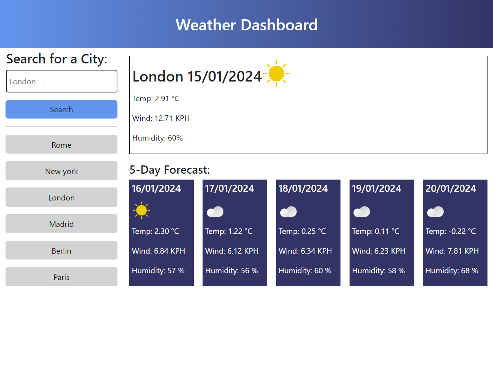

# Weather Dashboard

## Description

Project to build a weather dashboard allowing users quick access to view the current day and five-day weather forecast for a selected city. The project uses server API’s by making requests with specific parameters to a URL, saves searches to local storage and uses dynamically updated HTML and CSS.

The last six searches are saved to local storage. If additional searches are made, the oldest search will be removed so infinite searches are not added. If a search city already exists in local storage, this city name will not be added (to local storage or as a search button). 

On building this project, I have learnt how to use server API’s and understand how they work. I now feel confident in using them for future projects in maybe more complex and create ways. My understanding of functions, local storage and other JavaScript techniques have also developed further. 
 
## Installation

N/A

## Usage

Open in the browser, either enter a city name in the search field and click ‘Search’, or select a previously searched city name (from local storage if a previous search has been made) from the buttons below the Search button. Current day forecast and 5-day forecast for selected city will update. 

https://clairepricegithub.github.io/weather-dashboard/

## Credits

Flexiple. (n.d.). *JavaScript: Capitalize the first letter*. https://flexiple.com/javascript/javascript-capitalize-first-letter

Matthew C. (n.d.). *How do I Empty an Array in JavaScript?*. Sentry. https://sentry.io/answers/how-do-i-empty-an-array-in-javascript/#:~:text=Using%20the%20splice()%20Method&text=splice(0%2C%20arr.,from%20the%20start%20index%20position.

rifton007. (2021, February 22). *add or subtract by 'date' is not working*. Github. https://github.com/iamkun/dayjs/issues/681 

Techie Delight. (2021). *Loop through an array backward in JavaScript*. https://www.techiedelight.com/loop-through-array-backwards-javascript/

## License

Please refer to the LICENSE in the repo
